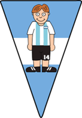

# AFA

Nando, uno de los creativos del nuevo proyecto de la Asociación de Festejos Argentinos, nos convoca para realizar un sistema que permita estimar costos e ingresos.   

1)	Sabiendo que messi cuenta actualmente con una popularidad del 98%, el chiqui quiere organizarle un homenaje por "la tercera", en la bombonera. La afa fija un precio de entrada, y la cantidad de entradas a vender se estima como el porcentaje de popularidad del jugador respecto de la capacidad del estadio. Por ejemplo, si se asume que la bombonera tiene una capacidad de 50.000, las entradas que se espera vender en el partido de messi seria 49.000. Si cada entrada cuesta 10.000$ la recaudación sería de 490 millones. Por otra parte, hay algunos gastos que contemplar. Los viáticos para messi dependerán del acuerdo al que se llegue oportunamente y se puede adelantar que hay un costo fijo propio de la logística del evento que asciende a 10 millones y que se debe pagar el alquiler el estadio. 
Asumir que se conocen los valores no específicados (por ejemplo, el alquiler de la bombonera) y que al igual que los que se detallan pueden variar.
    -	a) Calcular cuanto sería la ganancia neta del partido homenaje
    -	b) Realizar el partido, efectuando los correspondientes movimientos de dinero
    -	c) Averiguar cual es el estado actual de las arcas de la afa.

2)	Viendo el éxito del evento, ahora la afa decide invitar a otros jugadores a partidos homenajes y analiza otros estadios posibles. Incluso se podria hacer mas de un partido con el mismo jugador invitado, recorriendo diferentes estadios del país. Resolver los mismos requerimientos, pero con las siguientes consideraciones:
    -	a) La popularidad de Ronaldo es siempre la mitad de la de messi
    -	b) La popularidad de Mbappe se calcula como el doble de su edad más la cantidad de goles hechos en finales del mundo
    -	c) La capacidad del monumental depende del estado de avance de las obras de remodelación

3)	Mientras tanto, la vida continua y entre partido y partido algunas cosas cambian:
    - a)	Si hubiera inflación, el precio de la entradas puede variar. 
    - b)	Avanzan las obras del monumental.
    - c)	En particular, contemplar que al jugador invitado del momento le "pasaron cosas"
        - ●	Messi opina del nuevo presidente y pierde popularidad.
	    - ● Mbape cumple años
	    - ● Ronaldo se va a jugar a la antártida.

4)	Agregar tu jugador favorito y hacerle un homenaje en algún estadio. 
5)	Hacer los test correspondientes

